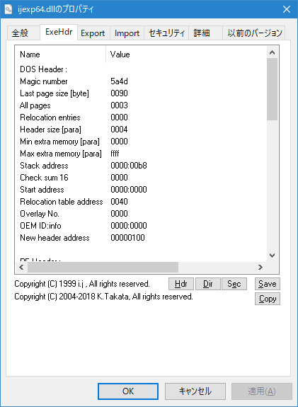
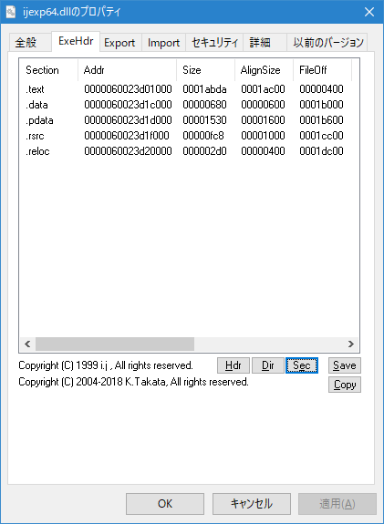
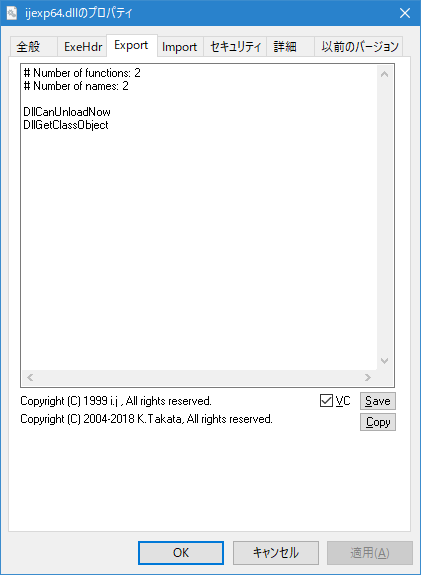
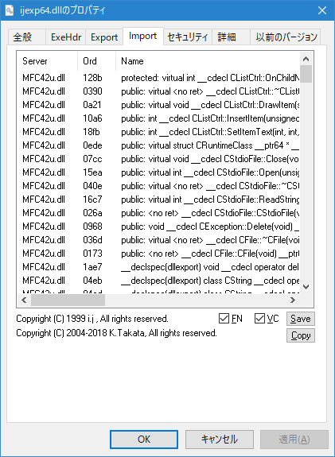

# i.j Shell Property Sheets Export/Import

This is a modified version of "[i.j Shell Property Sheets Export/Import 32](http://www.vector.co.jp/soft/win95/util/se111901.html)" (ijexp32) which was originally written by i.j.
Now it is maintained by K.Takata.

## Overview

This enables to show detail information of an executable file or a DLL file on the properties dialog box of Windows Explorer.
This shows information about PE header, exported symbols and imported symbols.
Imported or exported symbols are shown demangled if they are available.

## Supported platform

* Windows 7, 8, 10
  (Both 32- and 64-bit versions)

## Changes from the original version

* Provided as an installer file.
* Built with Unicode support.
* Support 64-bit Windows.
* Support showing information of 64-bit executable files. (x64, IA64 and ARM64)
* Support showing MinGW demangled symbols. (Using `c++filt.exe`.)
* Enable to customize supported extensions. (The original version only supported `*.exe` and `*.dll`.)
* Improve demangling VC++ symbols.
* Add some `*.exp` files.
* Support HiDPI environment.
* Fix some bugs.

## Usages and screenshots

### ExeHdr sheet

This property sheet shows information of executable file header.

If you click `SAVE` button, you can save the information to a file. 
If you click `COPY` button, you can copy the information to the clipboard.

#### Hdr tab

This tab shows information of MZ header and PE header.

#### Dir tab

This tab shows information of PE directories.

#### Sec tab

This tab shows information of PE sections.

### Export sheet

This property sheet shows information of exported symbols.

If `VC` check box is checked, VC++ or MinGW symbols are shown demangled. 
If not checked, ordinal numbers and non-demangled symbols are shown.

### Import sheet

This property sheet shows information of imported symbols.

If `VC` check box is checked, VC++ or MinGW symbols are shown demangled. 
If `FN` check box is unchecked, only imported DLLs are shown.

## Configurations

You can configure ijexp in the following ways:

1. Registry (`HKCU\Software\ijexp`) 
   See `ijexp_sample_settings.reg` for an example.
2. `%APPDATA%\ijexp\ijexp.ini`
3. `ijexp.ini` in the installed folder (`%ProgramFiles%\ijexp\ijexp.ini`)

## License

This is freeware. You can use it without charge. 
See [ijexp32.txt](ijexp32.txt) for detail. (Written in Japanese.)
